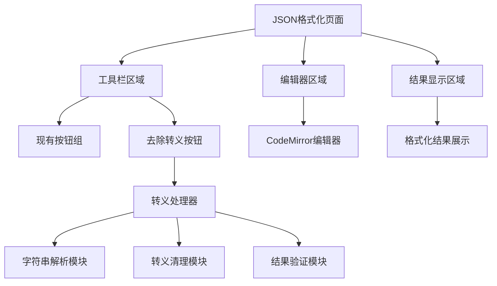
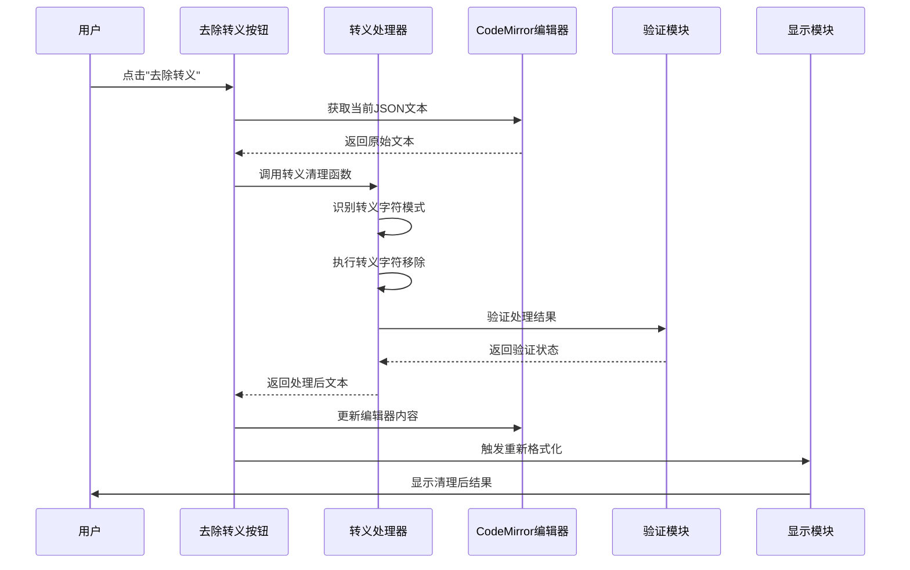
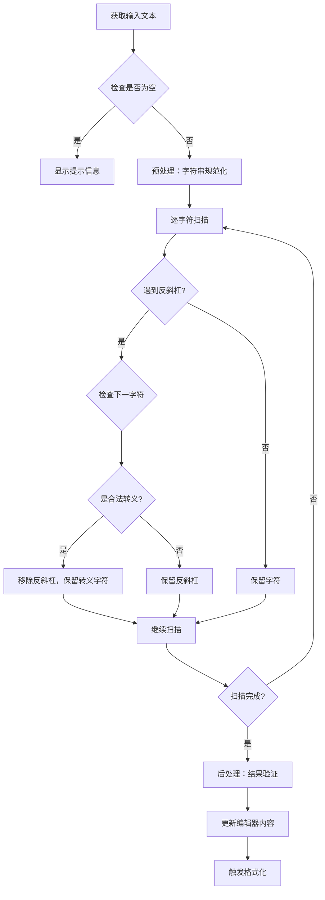
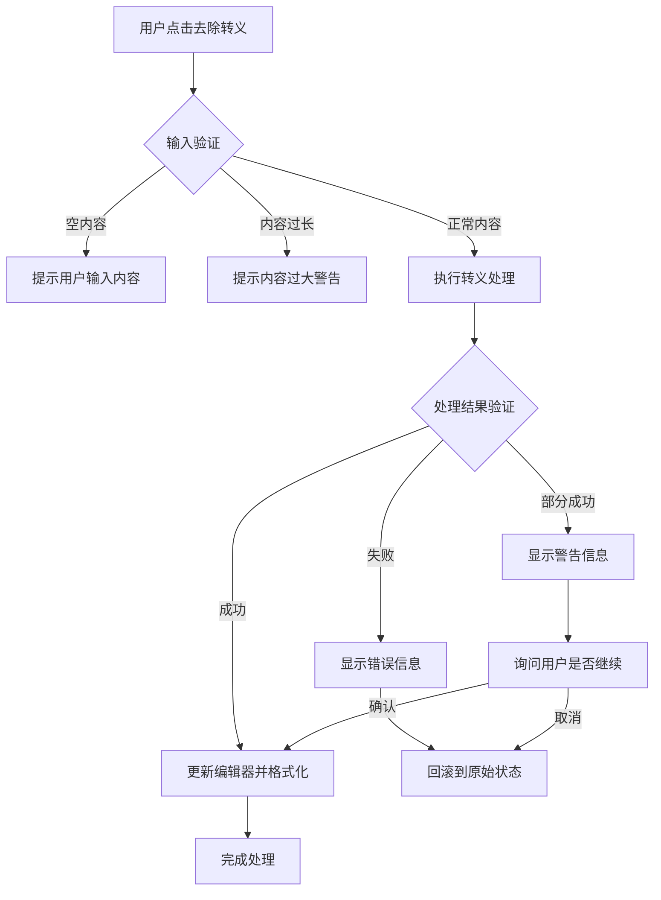

# JSON格式化去除转义功能设计

## 1. 功能概述

在FeHelper的JSON格式化工具页面添加"去除转义"按钮，实现对JSON字符串中反斜杠转义字符的批量移除功能。该功能旨在帮助开发者快速清理包含多余转义字符的JSON数据，提升数据处理效率。

### 目标用户
- 前端开发者：处理从后端接口返回的过度转义JSON数据
- 测试工程师：清理测试数据中的转义字符
- 数据分析师：处理包含转义字符的JSON格式数据

### 核心问题
解决JSON字符串中包含多个反斜杠转义字符（如`\"`、`\\`、`\/`等）导致的数据可读性差和解析困难问题。

## 2. 功能架构

### 组件层次结构



### 核心处理流程



## 3. 技术实现方案

### UI组件设计

#### 按钮位置布局
- 位置：工具栏区域，现有编码/解码按钮组右侧
- 样式：与现有按钮保持一致的设计风格
- 文案：`去除转义`

#### HTML结构修改
```html
<!-- 在现有工具栏中添加 -->
<span class="x-split">|</span>
<button class="btn btn-warning btn-xs" @click="removeEscapes" id="btnRemoveEscapes">去除转义</button>
```

### 核心算法设计

#### 转义字符识别模式

| 转义类型 | 原始形式 | 目标形式 | 处理优先级 |
|---------|---------|---------|-----------|
| 双引号转义 | `\"` | `"` | 高 |
| 反斜杠转义 | `\\` | `\` | 中 |
| 斜杠转义 | `\/` | `/` | 低 |
| 换行符转义 | `\n` | 换行符 | 中 |
| 制表符转义 | `\t` | 制表符 | 中 |
| 回车符转义 | `\r` | 回车符 | 低 |

#### 处理算法流程



### 函数接口设计

#### 主要处理函数

```javascript
/**
 * 去除JSON字符串中的转义字符
 * @param {string} jsonString - 原始JSON字符串
 * @param {Object} options - 配置选项
 * @param {boolean} options.preserveStructure - 是否保持JSON结构完整性
 * @param {Array<string>} options.escapeTypes - 要处理的转义类型列表
 * @returns {Object} 处理结果对象
 */
function removeJsonEscapes(jsonString, options = {}) {
    // 实现转义字符移除逻辑
}

/**
 * 验证处理后的JSON字符串有效性
 * @param {string} processedString - 处理后的字符串
 * @returns {Object} 验证结果
 */
function validateProcessedJson(processedString) {
    // 实现JSON有效性验证
}
```

#### Vue方法集成

```javascript
// 在index.js的Vue实例methods中添加
removeEscapes: function() {
    let source = editor.getValue();
    if (!source.trim()) {
        alert('请先输入JSON内容');
        return;
    }
    
    try {
        let result = removeJsonEscapes(source, {
            preserveStructure: true,
            escapeTypes: ['quote', 'backslash', 'slash', 'newline', 'tab']
        });
        
        if (result.success) {
            this.disableEditorChange(result.processed);
            this.format(); // 触发重新格式化
        } else {
            alert('去除转义失败：' + result.error);
        }
    } catch (error) {
        alert('处理过程中发生错误：' + error.message);
    }
}
```

## 4. 数据流设计

### 输入数据格式

```javascript
// 示例输入数据
const inputExamples = [
    // 基础转义
    '{"name": "张三", "desc": "这是一个\\"测试\\"字符串"}',
    
    // 多重转义
    '{"path": "C:\\\\Users\\\\Admin\\\\Documents\\\\file.txt"}',
    
    // 混合转义
    '{"url": "https:\\/\\/www.example.com\\/api\\/data", "note": "包含\\n换行符"}',
    
    // 复杂嵌套
    '{"data": "{\\"nested\\": \\"value\\", \\"array\\": [\\"item1\\", \\"item2\\"]}"}'
];
```

### 输出数据格式

```javascript
// 处理结果对象结构
const processResult = {
    success: true,           // 处理是否成功
    processed: string,       // 处理后的JSON字符串
    changes: number,         // 修改的转义字符数量
    error: string|null,      // 错误信息（如果有）
    warnings: Array<string>  // 警告信息列表
};
```

### 转义字符映射表

| 输入模式 | 输出结果 | 说明 |
|---------|---------|------|
| `\"` | `"` | 双引号转义 |
| `\\` | `\` | 反斜杠转义 |
| `\/` | `/` | 斜杠转义（可选） |
| `\n` | 实际换行 | 换行符转义 |
| `\t` | 实际制表符 | 制表符转义 |
| `\r` | 实际回车符 | 回车符转义 |

## 5. 错误处理与边界情况

### 异常场景处理



### 边界情况定义

1. **空输入处理**：提示用户输入内容
2. **无效JSON处理**：仅处理转义，不验证JSON格式
3. **过大内容处理**：限制处理内容大小，超过限制时给出警告
4. **特殊字符处理**：Unicode字符和特殊符号的转义处理
5. **嵌套JSON处理**：字符串中包含JSON格式的转义处理

### 错误消息设计

```javascript
const ERROR_MESSAGES = {
    EMPTY_INPUT: '请先输入需要处理的JSON内容',
    CONTENT_TOO_LARGE: '内容过大，建议分段处理（最大支持1MB）',
    PROCESSING_FAILED: '转义字符处理失败，请检查输入格式',
    INVALID_ESCAPE_SEQUENCE: '发现无效的转义序列，已跳过处理',
    PARTIAL_SUCCESS: '部分转义字符处理成功，存在{count}个警告'
};
```

## 6. 性能优化策略

### 处理性能指标

| 数据大小 | 预期处理时间 | 内存占用 | 优化策略 |
|---------|-------------|---------|---------|
| < 10KB | < 100ms | < 1MB | 直接处理 |
| 10KB-100KB | < 500ms | < 5MB | 分块处理 |
| 100KB-1MB | < 2s | < 10MB | 异步分块+进度显示 |
| > 1MB | 提示分段 | N/A | 拒绝处理 |

### 优化实现方案

```javascript
// 大文件异步处理策略
async function processLargeContent(content, progressCallback) {
    const CHUNK_SIZE = 10000; // 每块处理10000字符
    const chunks = [];
    
    for (let i = 0; i < content.length; i += CHUNK_SIZE) {
        chunks.push(content.slice(i, i + CHUNK_SIZE));
    }
    
    let processed = '';
    for (let i = 0; i < chunks.length; i++) {
        processed += removeJsonEscapes(chunks[i]).processed;
        progressCallback && progressCallback((i + 1) / chunks.length * 100);
        
        // 让出控制权，避免阻塞UI
        await new Promise(resolve => setTimeout(resolve, 10));
    }
    
    return processed;
}
```

## 7. 测试策略

### 单元测试用例

```javascript
// 测试用例设计
describe('JSON转义处理功能', () => {
    test('基础双引号转义处理', () => {
        const input = '{"name": "张三", "desc": "这是\\"测试\\""}';
        const expected = '{"name": "张三", "desc": "这是"测试""}';
        expect(removeJsonEscapes(input).processed).toBe(expected);
    });
    
    test('多重反斜杠转义处理', () => {
        const input = '{"path": "C:\\\\\\\\Users\\\\\\\\Admin"}';
        const expected = '{"path": "C:\\\\Users\\\\Admin"}';
        expect(removeJsonEscapes(input).processed).toBe(expected);
    });
    
    test('混合转义字符处理', () => {
        const input = '{"url": "https:\\/\\/example.com", "note": "Line1\\nLine2"}';
        const expected = '{"url": "https://example.com", "note": "Line1\nLine2"}';
        expect(removeJsonEscapes(input).processed).toBe(expected);
    });
    
    test('空输入处理', () => {
        expect(() => removeJsonEscapes('')).toThrow('空内容');
    });
    
    test('无转义字符内容', () => {
        const input = '{"name": "test", "value": 123}';
        const result = removeJsonEscapes(input);
        expect(result.processed).toBe(input);
        expect(result.changes).toBe(0);
    });
});
```

### 集成测试场景

1. **UI交互测试**：按钮点击、编辑器更新、结果显示
2. **性能测试**：不同大小文件的处理时间测试
3. **兼容性测试**：与现有格式化功能的协调工作
4. **错误恢复测试**：异常情况下的状态恢复能力

### 用户验收测试

1. **功能完整性**：所有类型转义字符都能正确处理
2. **操作便捷性**：一键处理，无需额外配置
3. **结果准确性**：处理后的JSON保持数据完整性
4. **性能满意度**：处理速度满足日常使用需求