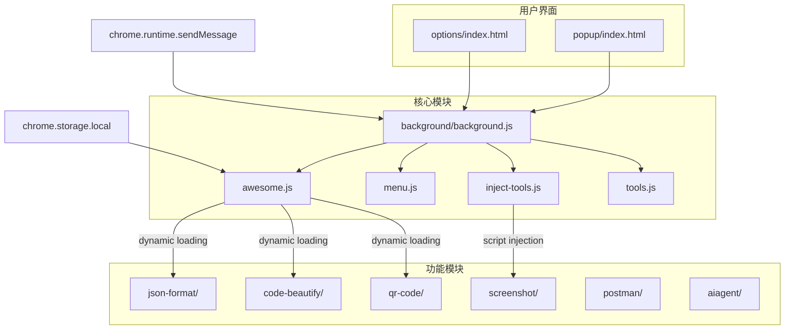
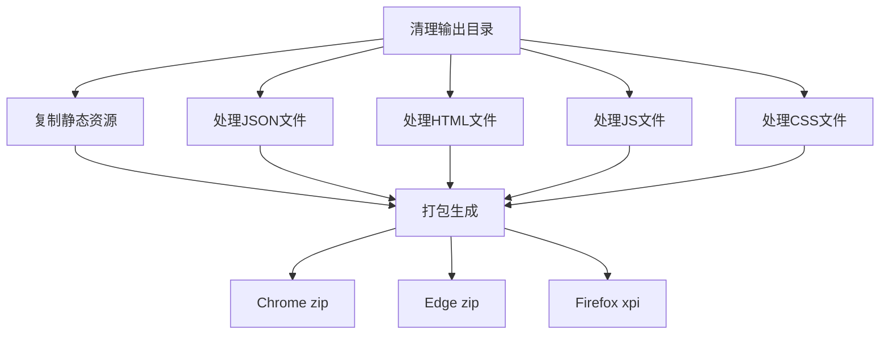
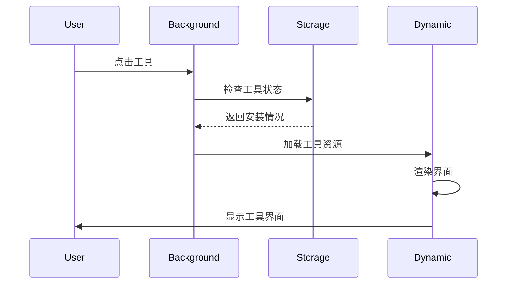

# FeHelper - 前端开发者工具集

FeHelper是一个模块化的浏览器扩展开发框架，专为前端开发者设计。基于Chrome扩展 Manifest V3 规范，采用开放平台架构，支持动态工具加载和多浏览器兼容。

## 技术特性

- 🏗️ **模块化架构** - 基于Chrome扩展API的三层架构设计
- 🔄 **动态加载** - 支持工具的动态安装、更新和卸载
- 🌐 **多浏览器支持** - Chrome、Firefox、Edge全平台兼容
- 📦 **自动化构建** - 基于Gulp的完整构建流程
- 🛡️ **安全机制** - CSP安全策略和沙箱执行环境

## 技术架构

### 架构模式

FeHelper 采用模块化架构，每个功能作为独立模块，支持动态加载、更新和卸载。



### 核心组件

- **background.js**: 消息中枢，协调各模块通信
- **awesome.js**: 核心管理引擎，负责工具的动态加载和生命周期管理
- **inject-tools.js**: 运行时脚本注入和权限管理
- **tools.js**: 工具元数据和配置管理
- **menu.js**: 右键菜单生成和事件处理

## 开发环境

### 环境要求

- **Node.js**: v14.0+
- **npm**: v6.0+
- **Gulp CLI**: v3.1.0+
- **Chrome/Edge/Firefox**: 最新版本

### 快速开始

```bash
# 克隆项目
git clone https://github.com/zxlie/FeHelper.git
cd FeHelper

# 安装依赖
npm install

# 开发模式（自动监听文件变化）
npm run watch

# 构建产品版
npm run build
```

### 项目结构

```
FeHelper/
├── apps/                    # 源代码目录
│   ├── background/         # 后台脚本
│   ├── popup/              # 弹出页面
│   ├── options/            # 配置页面
│   ├── static/             # 静态资源
│   ├── json-format/        # JSON工具
│   ├── code-beautify/      # 代码美化
│   ├── qr-code/            # 二维码工具
│   └── manifest.json       # 扩展配置
├── output/                  # 构建输出目录
├── gulpfile.js             # 构建配置
└── package.json            # 项目配置
```

## 构建系统

### Gulp 构建流程

项目采用 Gulp 4.x 作为构建工具，支持自动化的代码压缩、资源合并和打包。



### 构建命令

```bash
# 基本构建（Chrome）
npm run build
# 或
gulp

# Edge 扩展打包
gulp edge

# Firefox 扩展打包
gulp firefox

# 开发模式（监听文件变化）
npm run watch
# 或
gulp watch
```

### 模块合并机制

#### JavaScript 合并
支持通过 `__importScript()` 语法自动合并JS模块：

```javascript
// 在源文件中使用
__importScript('utils');
__importScript('api/request.js');

// 构建时自动合并为单个文件
```

#### CSS 合并
支持通过 `@import` 语法合并CSS文件：

```css
/* 在源文件中使用 */
@import "common.css";
@import "theme/dark.css";

/* 构建时自动合并和压缩 */
```

## 扩展机制

### 动态工具管理

FeHelper 采用开放平台设计，支持工具的动态加载和管理。



### 核心 API 接口

#### chrome.DynamicToolRunner
动态工具运行器，负责工具的加载和执行。

```javascript
// 运行工具
chrome.DynamicToolRunner({
    tool: 'json-format',
    withContent: data,
    query: 'param=value',
    noPage: false
});
```

#### Awesome 工具管理 API

```javascript
// 获取已安装工具
Awesome.getInstalledTools().then(tools => {
    console.log('已安装工具:', tools);
});

// 安装工具
Awesome.installTool(toolName, toolData);

// 卸载工具
Awesome.uninstallTool(toolName);
```

### 消息通信机制

基于Chrome Runtime API的消息传递系统：

```javascript
// 发送消息
chrome.runtime.sendMessage({
    type: MSG_TYPE.TOOL_OPERATION,
    tool: 'json-format',
    action: 'format',
    data: jsonData
});

// 接收消息
chrome.runtime.onMessage.addListener((request, sender, sendResponse) => {
    if (request.type === MSG_TYPE.TOOL_OPERATION) {
        // 处理工具操作
        sendResponse({ success: true });
    }
});
```

## 技术配置

### Manifest V3 配置

扩展使用 Manifest V3 规范，支持现代化的浏览器扩展开发：

```json
{
  "manifest_version": 3,
  "name": "FeHelper(前端助手)",
  "version": "2025.04.1110",
  "background": {
    "service_worker": "background/background.js",
    "type": "module"
  },
  "permissions": [
    "tabs", "scripting", "contextMenus", 
    "activeTab", "storage", "notifications",
    "unlimitedStorage", "sidePanel"
  ],
  "content_security_policy": {
    "extension_pages": "script-src 'self'; style-src 'self' 'unsafe-inline';"
  }
}
```

### 存储系统

使用 `chrome.storage.local` 存储工具数据，突破传统 localStorage 5MB 限制：

```javascript
// 存储工具数据
chrome.storage.local.set({
    [`FH_TOOL_${toolName}`]: toolData
});

// 读取工具数据
chrome.storage.local.get(`FH_TOOL_${toolName}`, (result) => {
    const toolData = result[`FH_TOOL_${toolName}`];
});
```

### 安全策略

- **CSP 限制**: 禁止内联脚本执行，防止 XSS 攻击
- **沙箱执行**: content-script 在沙箱中运行，避免污染页面
- **权限控制**: 最小化权限请求，可选权限动态申请

## 部署指南

### 本地开发调试

1. 构建扩展：
```bash
npm run build
```

2. 加载扩展：
   - 打开 `chrome://extensions/`
   - 开启开发者模式
   - 点击“加载已解压的扩展程序”
   - 选择 `output/apps` 目录

### 发布部署

```bash
# Chrome 商店发布
npm run build
# 上传 output/fehelper.zip 到 Chrome Web Store

# Edge 商店发布
gulp edge
# 上传 output-edge/fehelper.zip 到 Microsoft Edge Addons

# Firefox 商店发布
gulp firefox  
# 上传 output-firefox/fehelper.xpi 到 Firefox Add-ons
```

### 多浏览器兼容性

项目通过构建脚本自动处理不同浏览器的兼容性问题：

- **Chrome**: 使用 Manifest V3，Service Worker 模式
- **Edge**: 兼容 Chrome 扩展，去除 update_url 配置
- **Firefox**: 添加 browser_specific_settings，使用 background scripts

## 贡献指南

### 开发环境搭建

1. **Fork 和克隆项目**
```bash
git clone https://github.com/your-username/FeHelper.git
cd FeHelper
```

2. **安装依赖**
```bash
npm install
```

3. **开发模式**
```bash
npm run watch
```

### 代码贡献流程

1. 创建特性分支：`git checkout -b feature/your-feature`
2. 实现功能并添加测试
3. 遵循项目编码规范
4. 提交代码：`git commit -m 'Add: new feature'`
5. 推送分支：`git push origin feature/your-feature`
6. 创建 Pull Request

### 新工具开发

开发新工具需要遵循以下结构：

```
tool-name/
├── index.html          # 工具界面
├── index.js            # 主逻辑
├── index.css           # 样式文件
└── content-script.js   # 内容脚本（可选）
```

### 代码规范

- 使用 ES6+ 语法
- 遵循组件化开发原则
- 添加必要的注释和文档
- 确保代码通过 ESLint 检查
- 编写单元测试

## 许可证

本项目采用 ISC 许可证。详情请参阅 [LICENSE](LICENSE) 文件。

## 资源链接

- [项目主页](https://github.com/zxlie/FeHelper)
- [问题反馈](https://github.com/zxlie/FeHelper/issues)
- [官方网站](https://www.baidufe.com/fehelper)
- [Chrome 商店](https://chrome.google.com/webstore/detail/pkgccpejnmalmdinmhkkfafefagiiiad)
- [Edge 商店](https://microsoftedge.microsoft.com/addons/detail/feolnkbgcbjmamimpfcnklggdcbgakhe)

---

**技术支持**: 基于 Chrome 扩展 Manifest V3、Gulp 4.x、Node.js 14+ 构建
